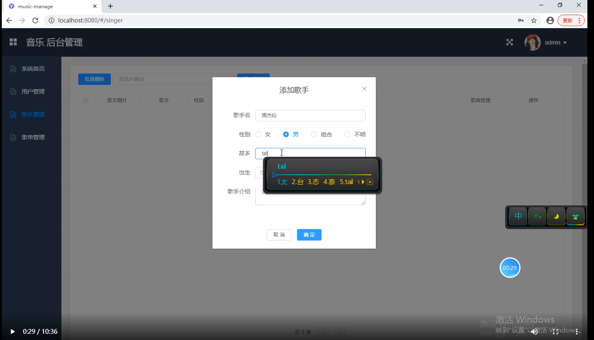

这是一个基于springboot+vue的前后端分离的在线音乐播放系统

项目代码已收录公众号【java项目源码】，需要请自行关注一下公众号并下载源码

该项目分为三个项目：
music-client：前端用户项目

music-manager: 前端管理员项目

music-server: 后端统一项目

用户功能：登陆注册，收藏音乐，播放音乐，评分，对音乐评论以及对歌单评论
管理员：对用户的增删改查，对歌手的增删改查，对歌单的增删改查，对歌曲的增删改查等等

CSDN博客地址：[基于springboot+vue的前后端分离的在线音乐播放系统](https://blog.csdn.net/mataodehtml/article/details/114536050)

运行视频地址：[基于springboot+vue的前后端分离的在线音乐播放系统](https://www.bilibili.com/video/BV1Zb4y1X7nj)

